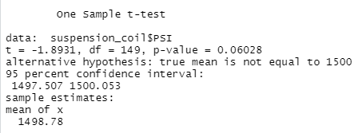
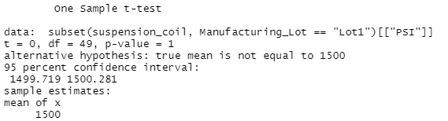
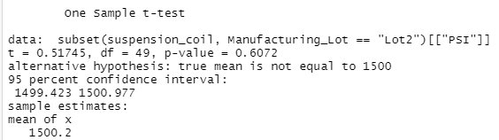
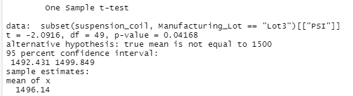

#  MechCar Analysis using R and Statistical Modelling 
## Overview
Using statistical modeling, I address specific questions and concerns related to MechaCar specifications.

## Linear Regression to Predict MPG
Based on the linear regression analysis performed on the variables provided by AutosRUs, the vehicle length and ground clearance variables have the most significant and non-random impact on mpg compared to the others. The slope of this linear model is not zero, given the resulting p-value of 5.35e-11. MPG can be effectively predicted from this model given the 0.71 value of r-squared, as this means that 71% of future predictions will be accurate. 

## Summary Statistics on Suspension Coils
The current manufacturing data of all lots of the MechaCar meets the design specifications. This can be seen in the variable box below: 

Lots 1 & 2 are within the acceptable range for variance. However, the variance for **Lot 3** is significantly out of scope.

## T-Tests on Suspension Coils

For the complete population test results, the p-value is above the assumed significance level of 0.05%. Thus the two means are statistically similar. 

The test on Lot 1 proved that the means are statistically identical with a p-value of 1. 

The test on Lot 2 proved statistically similar to the tests on the entire population with a p-value of 0.60, and the two means are statistically similar.

The test on Lot 3 proved statistically dissimilar from the population tests and the tests on the other lots. Its p-value of 0.04 comes in below the assumed significance level. 

## Study Design: MechaCar vs. Competition
A possible statistical study comparing MechaCar to the competition would be to examine retail prices and safety ratings. The null hypothesis might be that MechaCar’s retail price and safety rating make it no different from its competitors. The alternative hypothesis might be that MechaCar’s retail price and safety rating cause it to rise above its competitors. 

The best test for this study would be ANOVA because the study would examine the continuous data of sale price and the categorical value of safety rating. Required data for these tests would include all vehicles' retail prices and safety ratings that AutosRUs considers competitors to MechaCar.
