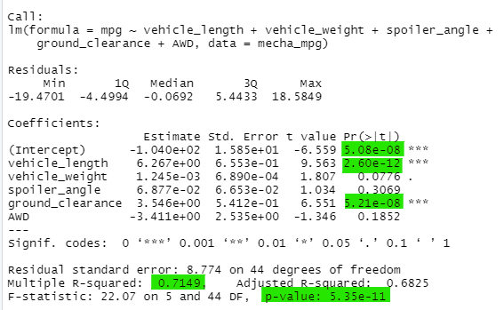
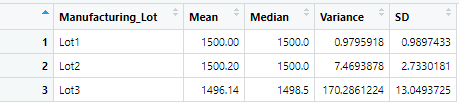

#  MechCar Analysis using R and Statistical Modelling 
## Overview
Using statistical modeling, I address specific questions and concerns related to MechaCar specifications.

## Linear Regression to Predict MPG
Based on the linear regression analysis performed on the variables provided by AutosRUs, the vehicle length and ground clearance variables have the most significant and non-random impact on mpg compared to the others. The slope of this linear model is not zero given the resulting p-value of 5.35e-11. MPG can be effectively predicted from this model given the 0.71 value of r-squared as this means that 71% of future predictions will be accurate. 

## Summary Statistics on Suspension Coils
The current manufacturing data of all lots of the MechaCar meets the design specifications. This can be seen in the variable box below: 

However, the variance for **Lot 3** is significantly out of scope, and production should be assessed. 

